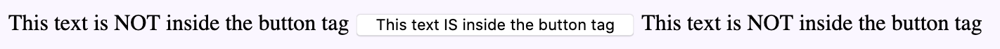
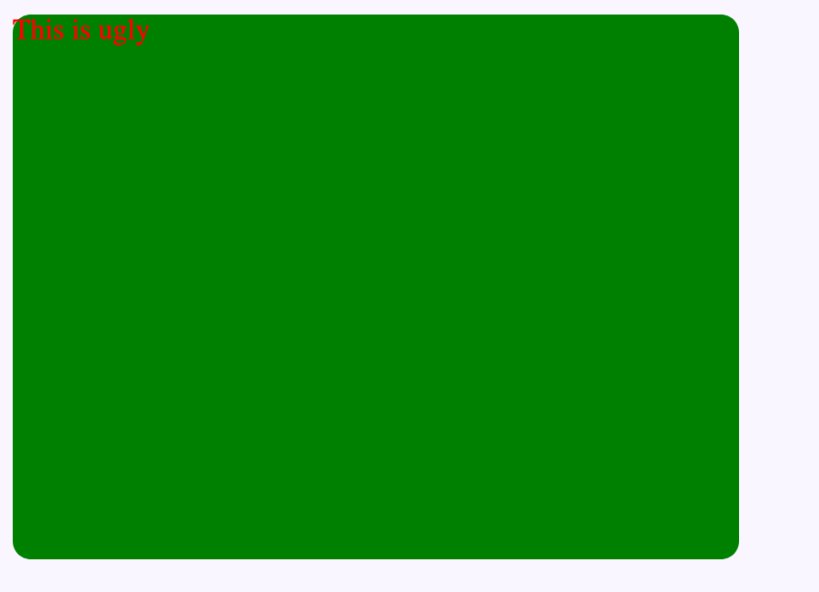
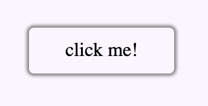

# Understanding HTML

HTML stands for hypertext markup language but the important part is the last half of 
that word: markup language. The memes are all true - HTML is NOT a programming language
and this distinction is important when you're learning html. HTML is meant to display 
the content and structure of a website and only that. If you were to write 2 + 2 in HTML,
it would literally just display "2 + 2" and not calculate 4.

With this in mind, know that pretty much all text that you write in your html file will end 
up being displayed on the website and that's because the text in html defines the *content* 
of your website. Aside from text, you'll find something called "tags" in html. Tags can be
recognized as text with angled brackets (< and >). Tags are what we use to denote the *structure*
of a webpage. Most HTML tags are opened with an opening tag <tagName> and then closed with a 
closing tag </tagName>. Note that the difference between the two is that the closing tag name 
is prefixed with a backslash '/'.

An example can be seen here:

```html
<div>
  This is text inside a div
</div>
```

What we usually use in HTML to structure our websites is the 'div' tag - short for
division. However, a better example of how we structure things is to use a button tag

```html
This text is NOT inside the button tag

<button>
  This text IS inside the button tag
</button>

This text is NOT inside the button tag

```
Which results in this:




Notice, how we can specify structure by either having something inside of an HTML
tag or as a sibling to one. With this compositional structure in mind, you can 
create any website you want.

This is probably not what we want our website to look like since this is fairly
plain-looking (unless that's what you want) and so the next tool we're going to
reach for is called CSS.

Main takeaway: HTML defines the *content* and *structure* of the webpage.

# Understanding CSS

CSS, or cascading stylesheets, is how we "style" our html. In other words, it makes 
our html look pretty. Remembering that HTML denotes the content and structure of 
our site (i.e. the text to display and in what order we should display them in),
CSS allows us to make it look beautiful.

Luckily for us, the basic (and advanced, tbh) functionality of css very simple syntax.

The general structure is this:

```css
selector{
  property1: value1;
  property2: value2;
  ...
}
```

The idea is that we can apply certain "styles" to an element by first having a 
"selector" and a list of "properties" to be applied to any element targeted by 
that selector.

To see an example:

```css
div{
  background-color: green;
  height: 300px;
  width: 400px;
  border-radius: 10px;
  color: red;
}
```

The above example is just for reference and if you actually add that style, your
site will look pretty gross but I think it's a good example to start off on.

What these 7 lines of css will do is set every single div element in your html 
to have a green background with red text and set them to 300x400px size with 
rounded corners.



We're going to end up with a lot of divs so it's generally a bad idea to target
all of the divs with css properties so what we usually use are "classes" and 
the way we write this will look like this:

### index.html 
```html
<div class="my-button">
  click me!
</div>
```

### styles.css
```css
.my-button{
  box-shadow: 0px 0px 2px 2px #888888;
  height: 28px;
  width: 120px;
  border-radius: 4px;
  padding-top: 10px;
  text-align: center;
}
```

Which results in this:



Main takeaway: CSS makes the webpage look pretty by styling the HTML.

# Understanding Javascript

Ideally, you already know a programming language and this could be
C, C++, Java, Python, whatever... you'll find that all programming 
languages usually have the same concepts and what differs is the syntax.

So, I'll go over some basic syntax

Variable declaration:
```js
let x = 4;
x = "hello";
x = [2, 4, "hello"];
// this is all valid js code
```
If you write python, this might not be as confusing but just know
that there's no strict typing in js. With that in mind, there's
not need to define a specific type for variables and we just use the
keyword 'let'. There are other ways of instantiating variables such 
as 'var' and 'const' but these require more in-depth analysis than I 
can go into here but just wanted to *let* you know they exist. 

Variables are also weakly typed resulting in implicit type coercion:

```js
let y = 3 + 'he';
console.log(y); // prints out '3he'

let z = 3 + '2'; // prints out '32'
// since 2 is a string, it does a string concatenation instead of
// a mathematical operation
```

## If statements

```js
if(true){
  console.log("print true");
}else{
  console.log("print false");
}

// or this:
if(true) console.log("print true");
else  console.log("print false");

// or
if(true)  console.log("print true");
else if (true) console.log("this is an else if");
 

// if you like, you can use ternary or binary operators
let a = (3 < 4) ? 3 : 4; // a = 3
// since  3 < 4 returns true, it sets the value to 3
```
... or you can do a switch statement

## Loops
The most common loops are these for loops
```js
for(let i = 0; i < 10; i++){
  console.log(i);
}
```

but often times, you'll see something like this

```js
let arr = [3, 4, 6, 8, 2];
arr.map(function(element, index){
  console.log(index);
});
```
This is a js specific function that loops over the array and calls
the function in the parameter on every single element on the array.

You can read more in the MDN docs to learn about these array functions:

https://developer.mozilla.org/en-US/docs/Web/JavaScript/Reference/Global_Objects/Map

## functions

```js
function functionName(parameter1, parameter2){
  //do stuff here
  return 3;
}
// sometimes you might see an arrow function
const functionName = (parameter1, parameter2) => {
  return 3;
}
```

You will see the arrow function sometimes in weird forms but they're really 
just normal functions so don't get scared! There are very small subtle differences 
between the two but none that you should worry about for now. (The main difference is 
that the arrow function binds 'this' if you're curious. Just know that JS gets REALLY 
weird with 'this' so be careful when working with objects)

Combining the previous two concepts, you'll often see something like this

```js
arr.map((element, index) => {
  console.log(index);
});
```

which is the same thing as the map function above except with an arrow function instead

## Network Calls/Fetch

```js
let url = "https://n161.tech/api/dummyapi/user";
fetch(url).then(response => {return response.json();}).then(response => {
  console.log(response);
});
```


# Putting it all together

A quick sample program of how it would all wrap up together

### index.html
```html
<!DOCTYPE html>
<html>
  <head>
    <link rel="stylesheet" type="css/text" href="./link/to/your/css/stylesheet.css" />
    <script src="./link/to/your/javscript.js"></script>
  </head>
  <body>
    <button class="my-button" onclick="clicked();"> click me! </button>
  </body>
</html>
```

### styles.css
```css
.my-button{
  box-shadow: 0px 0px 2px 2px #888888;
  height: 28px;
  width: 120px;
  border-radius: 4px;
  padding-top: 10px;
  text-align: center;
}
```

### script.js
```js
function clicked(){
  console.log("I got clicked!");
}
```

Main takeaway: JS is what brings interactivity to our site, and is what turns a webpage into a webapp.
