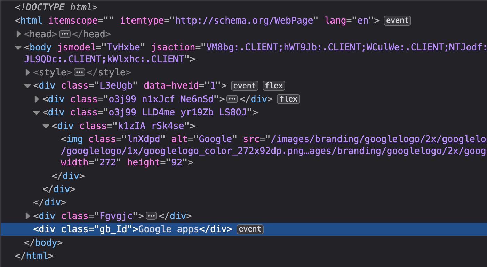
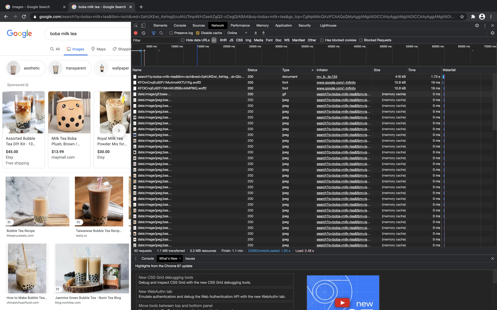

# Learning about http requests (~6 minutes)

## What are HTTP requests?

HTTP is the most common way to communicate through the internet. You make HTTP requests everyday without even realizing it. Whenever you go on a website, you are making an HTTP request. We can think of HTTP requests as the way pass information through the internet - the mail service for the web. Here's an example:

If I go to https://google.com, I am making an HTTP request to the Google server asking them to give me their homepage. The Google server then returns an HTML file (called a response or HTTP response) and then displays it as a webpage.

First, I enter the website url (the url tells which server to make a request to)

After the browser makes the HTTP request, the server processes it and returns a response. In this case, it returned an HTML file:

My browser sees the response and notices it's an HTML file and goes "Hey! I know how to read HTML files" and parses the code, displaying a beautiful website.

## HTTP Request Methods

The HTTP request detailed above is known as a `GET` request. This is because we are *getting* information. 

Here are the most common HTTP request methods:

* `GET` - recieves data. Most commonly used when accessing websites or making api calls
* `POST` - updates data. An example is when a user updates their Facebook relationship status.
    * In this example, a user isn't getting data from a server, they're sending data to the Facebook servers and letting them know they are updating a data field
* `CREATE` - creates data. An example is when a user is creating a new post on their blog, their computer will send a CREATE http request to the server.
* `DELETE` - deletes data. Use when deleting data.
* [Others](https://developer.mozilla.org/en-US/docs/Web/HTTP/Methods) but likely won't need for the duration of a hackathon

Every http request you make will be of one of these types - most commonly being `GET` requests. Although the type of method an HTTP request embodies is purely stylistic (you can write a server that only uses `GET` requests if you wanted to), the client must use the correct method. We will explore this concept later.

## HTTP Response Codes

When you make an HTTP request, the corresponding HTTP response will come with a [response code](https://developer.mozilla.org/en-US/docs/Web/HTTP/Status). Each response code represents something and a client can use this information to decide what to do with that information. They are as follows:

* Informational responses (100–199)
* Successful responses (200–299)
* Redirects (300–399)
* Client errors (400–499)
* Server errors (500–599)

Most likely you've seen or heard or stumbled upon a `404` page. When you go on a url that doesn't exist, they will return a `404 - Page Not Found` (Client Error) because you, as the client, are trying to access a page that doesn't exist.

For example, my Github profile is real and exists and you can access it with this link: [https://github.com/ryqndev](https://github.com/ryqndev)

When you go on a profile that doesn't actually exist though:
[https://github.com/this-profile-doesnt-exist-and-is-fake](https://github.com/this-profile-doesnt-exist-and-is-fake)
You `get` a `404` error. Github is fancy and notices a `404` error and makes their own custom `404` error page.

Imagine the Google server stops working for a minute, you'll likely see some sort of 5XX error returned. This is because when the server is down, it results in a server error.

We can think of a [404 - Not Found](https://developer.mozilla.org/en-US/docs/Web/HTTP/Status/404) as trying to enter a house but the address you gave doesn't exist and a [500 - Internal Server Error](https://developer.mozilla.org/en-US/docs/Web/HTTP/Status/500) as trying to enter a house but it literally just burned down.

What is the point of these server codes? We use these status codes to help us debug (and figure out who to blame) and we will see how we can use this to help us debug later on.

## Testing HTTP requests

There are a couple ways we can look at HTTP requests. When we're doing individual testing of a single http request or api, we'll likely be using a tool specifically meant for this. I would recommend [Insomnia(Core)](https://insomnia.rest/download/) to those who just need basic http request testing (our case) but [Postman](https://www.postman.com/downloads/) is the more powerful and popular choice. However, Postman is so powerful and so complex that I do believe it's overkill for our purposes. Here's an interesting [comparison](https://gist.github.com/samoshkin/c0a2c0dd85b1d5b02d893a0f6ac0e93c) for those interested, although it's a bit outdated. 

For the following demo, I'll be using **Insomnia**.

The other way we'll be debugging HTTP requests is with the browser dev tools. 

For the following demo, I'll be using **Chrome**.

We can open up the dev tools by either right clicking anywhere on the webpage and selecting `Inspect` from the dropdown:

or pressing `Command + Shift + C` or `Command + Option + C` on Mac or `Control + Shift + C` on Windows/Linux

## When to make HTTP requests

I mentioned earlier that we use HTTP requests when we access a website - more specifically, a `GET` request that *gets* usually an HTML file which gets displayed in our browser. However, the website itself can make more HTTP requests. For example, if the HTML says that it needs more resources, it will make more HTTP requests to potentially even different servers. The simplest example is a website with images.

Here is the `Network` tab of the developer tools on Chrome when I do a google image search for "boba milk tea"

There's a TON of network requests that are getting displayed here so let's look at them closely. The first request is the one we make by accessing the website. Remember how typing in a URL and accessing a webpage in and of itself was an HTTP request? Well, that's what it is - a `GET` request that 'gets' and HTML file. However, that one HTML file (that ends up being the webpage on the left) actually wants to display a bunch of images as well and these images are not embedded within the HTML file itself, but rather as external resources/static assets and so the browser has to make more trips through the internet and completes a separate HTTP request (`GET`) for EVERY SINGLE IMAGE. You can tell that request #4 and on are all images because under the `Type` column, it says jpeg - which is an image type. Notice how there's an abundance of information about every single HTTP request in the Network tab. This a way to debug network requests in the browser.

Phew! That was a lot to take in but now we can actually talk about why we're going to need HTTP requests to make API calls.

We use HTTP requests for pretty much any time we need to reach for data that's accessible through the internet and we can make HTTP requests as many times as we want in our webapp. When we make API requests, we'll be largely using HTTP requests to get data that we can then transform using Javscript and display them to our end user in some way.